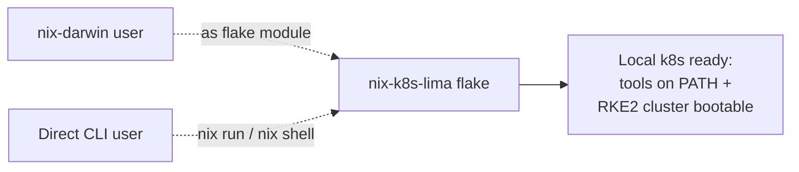
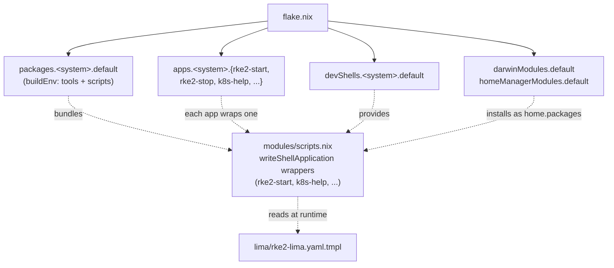
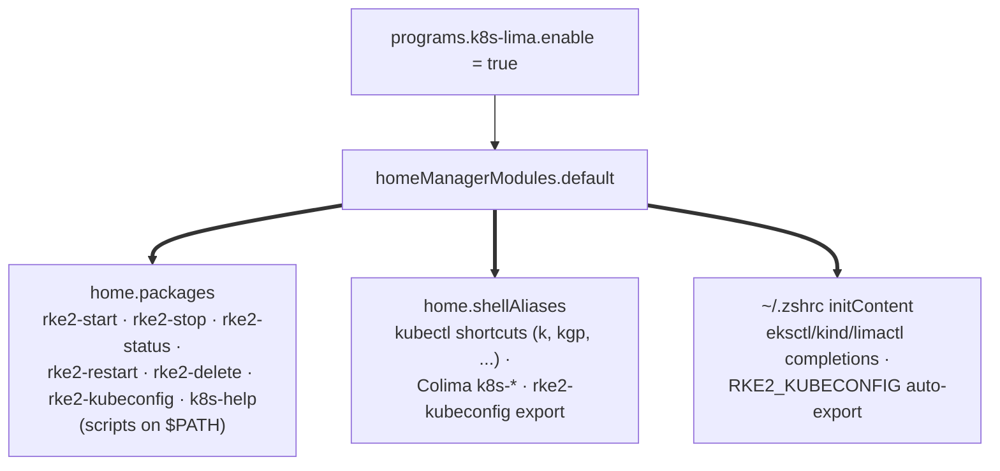
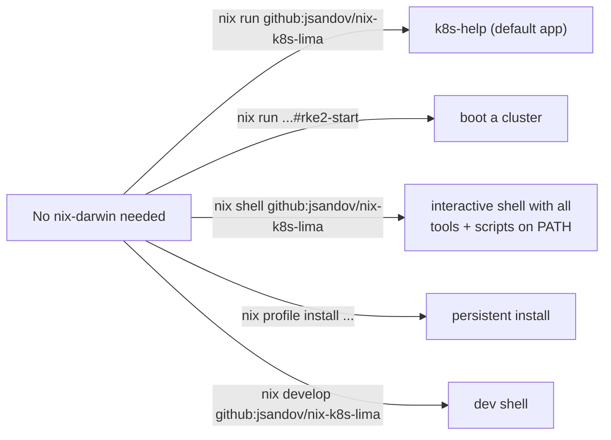
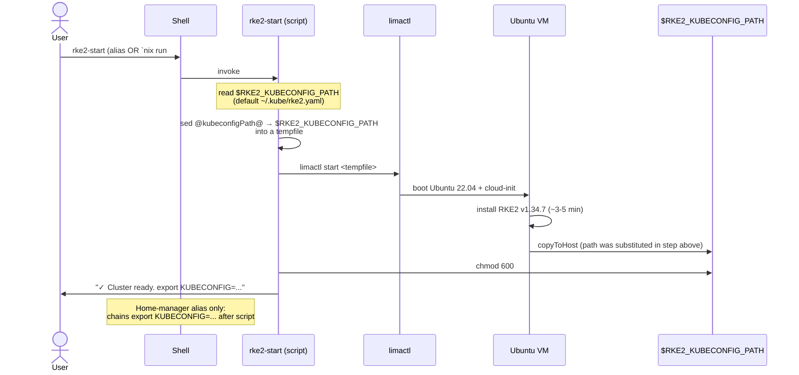

# Architecture

How the pieces of `nix-k8s-lima` fit together — for contributors and curious users. For setup/usage instructions, see the [README](./README.md).

Each diagram below adds one layer to the previous one. Read top to bottom.

## 1. The 30,000-foot view



Two distinct consumer paths feed into the same flake. Whether you're a nix-darwin user importing modules or a CLI user invoking `nix run`, you get the same toolset and the same `rke2-start` behavior.

## 2. What's inside the flake



`flake.nix` exports four kinds of things: **modules** (for nix-darwin/home-manager), **packages** (for `nix shell` / `nix profile install`), **apps** (for `nix run`), and **devShells** (for `nix develop`). The interesting bit is the dotted edges: every consumer path eventually pulls from the same `modules/scripts.nix`. That file produces a small set of `writeShellApplication` derivations — one per command — and they are the single source of truth. CLI users invoke them via `nix run`; module users get them installed into `home.packages`. There is no separate "CLI version" to keep in sync.

## 3. The system module (`services.k8s-lima.enable`)

```mermaid
flowchart LR
    EN["services.k8s-lima.enable = true"] --> DM["darwinModules.default"]
    DM ==> SYS["environment.systemPackages<br/>kubectl · k9s · lima · colima · stern · ..."]
    DM ==> BREWS["homebrew.brews<br/>helm · awscli · eksctl · grafana"]
    DM ==> CFG["nixpkgs.config.permittedInsecurePackages<br/>+= [ \"lima-1.0.7\" ]"]
```

The system module is the simple one. Flip `enable` and you get a fixed list of Nix packages plus a list of Homebrew brews. It also accepts the lima insecure-package status on the consumer's behalf so you don't have to. Knobs: `enable`, `enableHomebrew`, `extraPackages`.

## 4. The user module (`programs.k8s-lima.enable`)



The user module installs the wrapped scripts onto your `$PATH` (so they work in any shell, scripted contexts included), then layers two thin things on top: zero-overhead aliases for kubectl shortcuts and Colima commands, plus zsh completions and one auto-export. The `rke2-start` alias is a special case — it wraps the script with a trailing `&& export KUBECONFIG=...` so the env var lands in your current shell (a script can't export to its parent).

## 5. The CLI surface (no module, no rebuild)



CLI usage requires zero Nix configuration on the consumer's side — just a working Nix install with flakes enabled. `RKE2_KUBECONFIG_PATH` env var (default `$HOME/.kube/rke2.yaml`) and `RKE2_LIMA_YAML_TMPL` env var (default the flake-provided template) let you tune behavior per-invocation.

## 6. Runtime: what `rke2-start` actually does



The script renders the Lima yaml at *runtime* via `sed`, dropping the result in a tempfile and pointing `limactl` at it. This means the same script works for a home-manager user (with `kubeconfigPath` baked in as the default at module-eval time) and for a CLI user (overriding via `$RKE2_KUBECONFIG_PATH`). Lima itself can't expand shell variables inside its yaml, so the substitution has to happen before `limactl` reads the file.
