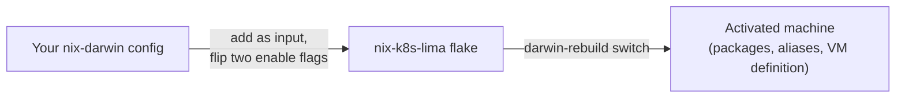
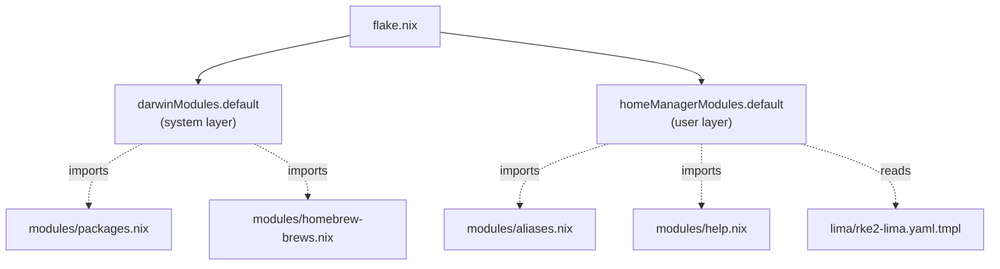
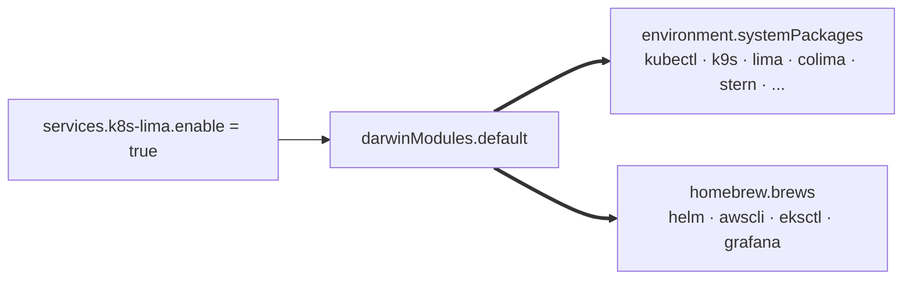
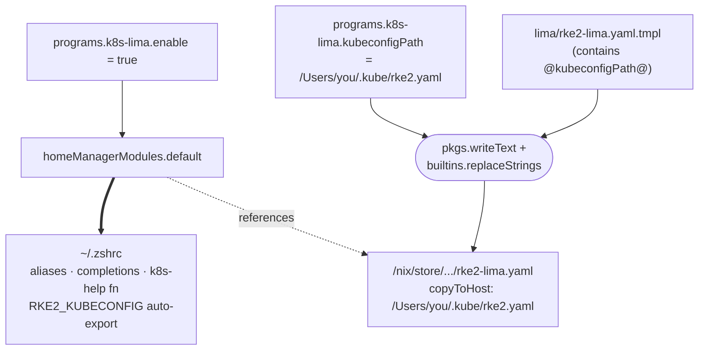
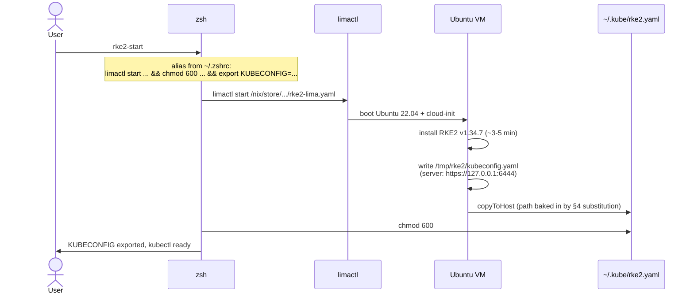

# nix-k8s-lima

Reusable Nix flake exposing Kubernetes, Lima/RKE2, and container tooling as `darwinModules.default` and `homeManagerModules.default`. Drop into any nix-darwin config to get a full local-Kubernetes development environment with one input and two `enable = true` flags.

## Architecture

Each diagram below adds one layer to the previous one. Read top to bottom.

### 1. The 30,000-foot view



A consumer (left) imports this flake and turns on two switches. After a rebuild, the machine has everything it needs to do local Kubernetes development.

### 2. What's inside the flake



`flake.nix` exports exactly two things: a system module and a user module. Each module pulls in small helper files (packages, aliases, brew lists, the help function) so the module bodies themselves stay short and readable. The Lima yaml lives as a static template alongside.

### 3. What the system module activates



The system module is the simple one. Flip `enable` and you get a fixed list of Nix packages plus a list of Homebrew brews. `enableHomebrew = false` skips the brews; `extraPackages = [ pkgs.foo ]` appends. That's it.

### 4. What the user module activates (and the eval-time substitution)



The user module is where the interesting work happens. It writes shell aliases, sources zsh completions, and defines `k8s-help` — all of that goes into `~/.zshrc`. Separately, at Nix eval time, it reads the Lima yaml template, substitutes `@kubeconfigPath@` with whatever the consumer set as `kubeconfigPath`, and writes the result to the nix store. Nix can do this because `kubeconfigPath` is a string known during evaluation. Lima itself can't — it doesn't expand shell variables inside yaml — which is why the substitution has to happen here.

### 5. Runtime: what `rke2-start` actually does



`rke2-start` is a single chained alias. The yaml it points at is the substituted derivation from §4 — its `copyToHost` field already contains your absolute kubeconfig path, so when Lima copies the file out it lands exactly where the alias expects to find it. The shell then tightens permissions and exports `KUBECONFIG` for the current session.

## What it provides

**System layer (`darwinModules.default`):**
- Nix packages: `kubectl`, `k9s`, `kubectx`, `kube-score`, `krew`, `stern`, `popeye`, `kind`, `colima`, `docker`, `docker-compose`, `dive`, `lazydocker`, `lima`
- Homebrew brews: `awscli`, `helm`, `eksctl`, `grafana` (toggle with `enableHomebrew`)

**User layer (`homeManagerModules.default`):**
- Shell aliases: `k`/`kgp`/`kgs`/`kgd`/`kgn`/`kdp`/`kds`/`kl`/`kx`/`kn` (kubectl), `k8s-*` (Colima), `rke2-*` (Lima)
- Zsh completions for `eksctl`, `kind`, `limactl`
- `k8s-help` shell function with quickstart docs
- Auto-exports `RKE2_KUBECONFIG` if Lima has copied a kubeconfig to the host

**Static assets:**
- `lima/rke2-lima.yaml.tmpl` — Lima VM definition that boots Ubuntu 22.04, installs RKE2 v1.34.7, and forwards the API to host port 6444 (avoiding a Colima collision on 6443)
- `manifests/alpine-pod.yaml` — trivial test pod

## Usage

```nix
# flake.nix in your nix-darwin config
{
  inputs.nix-k8s-lima.url = "github:jsandov/nix-k8s-lima";
  inputs.nix-k8s-lima.inputs.nixpkgs.follows = "nixpkgs";

  outputs = inputs@{ self, nix-darwin, nixpkgs, home-manager, nix-k8s-lima, ... }: {
    darwinConfigurations.your-host = nix-darwin.lib.darwinSystem {
      modules = [
        nix-k8s-lima.darwinModules.default
        {
          services.k8s-lima.enable = true;

          home-manager.users.your-user = {
            imports = [ nix-k8s-lima.homeManagerModules.default ];
            programs.k8s-lima.enable = true;
          };
        }
        # ... your other modules ...
      ];
    };
  };
}
```

## Module options

### `services.k8s-lima` (system)

| Option | Type | Default | Notes |
|---|---|---|---|
| `enable` | bool | `false` | Master switch for system packages + brews |
| `enableHomebrew` | bool | `true` | Add awscli/helm/eksctl/grafana to `homebrew.brews` |
| `extraPackages` | list of pkg | `[]` | Extra Nix packages to install alongside the defaults |

### `programs.k8s-lima` (home-manager)

| Option | Type | Default | Notes |
|---|---|---|---|
| `enable` | bool | `false` | Master switch for shell integration |
| `kubeconfigPath` | str | `${config.home.homeDirectory}/.kube/rke2.yaml` | Absolute host path for Lima `copyToHost` and shell aliases. Must be absolute (no `$HOME` or `~`) — Lima reads the YAML from the nix store. |
| `limaYamlPath` | str | flake-provided template (in nix store) | Override with a path to a writable copy if you want to hot-edit the Lima yaml |
| `enableCompletions` | bool | `true` | Source eksctl/kind/limactl zsh completions |

## Requirements

You bring your own `nix-darwin` and `home-manager` inputs — this flake only exposes module values. nixpkgs is pinned to `nixpkgs-25.05-darwin`; it is recommended (but not required) that consumers `follows` it to the same branch.

## Quickstart

```sh
# Once enabled and a darwin-rebuild switch later:
rke2-start            # boot the VM, install RKE2 v1.34.7, drop kubeconfig to ~/.kube/rke2.yaml
k get nodes           # talk to the cluster (lima-rke2 should be Ready)
k8s-help              # full command reference
```

## License

MIT
