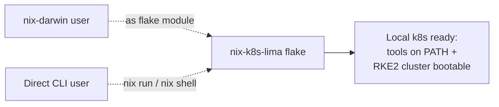
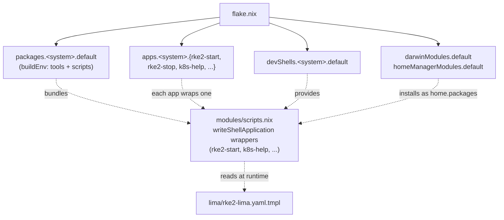
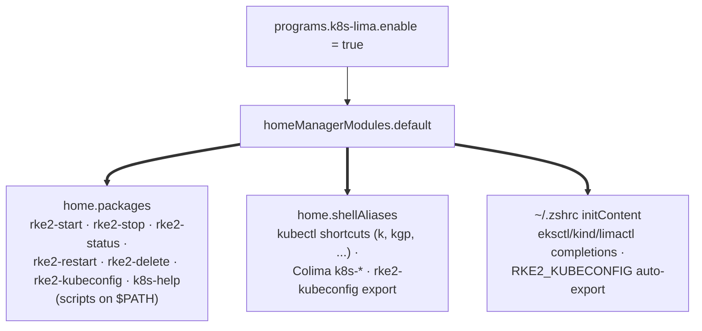
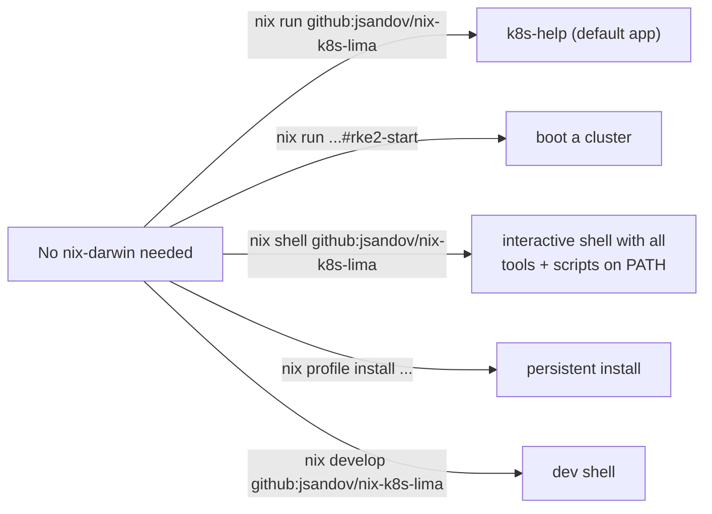
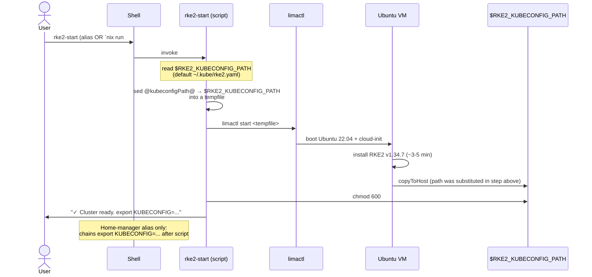

# nix-k8s-lima

Reusable Nix flake for local Kubernetes development on macOS. Bundles `kubectl`, `k9s`, `lima`, `colima`, `stern`, `popeye`, and friends, plus a one-command Lima VM that boots an RKE2 cluster.

**Use it three ways:**

| You have | What you do |
|---|---|
| `nix-darwin` + `home-manager` | Import the modules, flip two `enable` flags |
| Just Nix (no nix-darwin) | `nix shell github:jsandov/nix-k8s-lima` for a one-off session, or `nix profile install` to make it persistent |
| Just want to boot a cluster | `nix run github:jsandov/nix-k8s-lima#rke2-start` |

## Architecture

Each diagram below adds one layer to the previous one. Read top to bottom.

### 1. The 30,000-foot view



Two distinct consumer paths feed into the same flake. Whether you're a nix-darwin user importing modules or a CLI user invoking `nix run`, you get the same toolset and the same `rke2-start` behavior.

### 2. What's inside the flake



`flake.nix` exports four kinds of things: **modules** (for nix-darwin/home-manager), **packages** (for `nix shell` / `nix profile install`), **apps** (for `nix run`), and **devShells** (for `nix develop`). The interesting bit is the dotted edges: every consumer path eventually pulls from the same `modules/scripts.nix`. That file produces a small set of `writeShellApplication` derivations — one per command — and they are the single source of truth. CLI users invoke them via `nix run`; module users get them installed into `home.packages`. There is no separate "CLI version" to keep in sync.

### 3. The system module (`services.k8s-lima.enable`)

```mermaid
flowchart LR
    EN["services.k8s-lima.enable = true"] --> DM["darwinModules.default"]
    DM ==> SYS["environment.systemPackages<br/>kubectl · k9s · lima · colima · stern · ..."]
    DM ==> BREWS["homebrew.brews<br/>helm · awscli · eksctl · grafana"]
    DM ==> CFG["nixpkgs.config.permittedInsecurePackages<br/>+= [ \"lima-1.0.7\" ]"]
```

The system module is the simple one. Flip `enable` and you get a fixed list of Nix packages plus a list of Homebrew brews. It also accepts the lima insecure-package status on the consumer's behalf so you don't have to. Knobs: `enable`, `enableHomebrew`, `extraPackages`.

### 4. The user module (`programs.k8s-lima.enable`)



The user module installs the wrapped scripts onto your `$PATH` (so they work in any shell, scripted contexts included), then layers two thin things on top: zero-overhead aliases for kubectl shortcuts and Colima commands, plus zsh completions and one auto-export. The `rke2-start` alias is a special case — it wraps the script with a trailing `&& export KUBECONFIG=...` so the env var lands in your current shell (a script can't export to its parent).

### 5. The CLI surface (no module, no rebuild)



CLI usage requires zero Nix configuration on the consumer's side — just a working Nix install with flakes enabled. `RKE2_KUBECONFIG_PATH` env var (default `$HOME/.kube/rke2.yaml`) and `RKE2_LIMA_YAML_TMPL` env var (default the flake-provided template) let you tune behavior per-invocation.

### 6. Runtime: what `rke2-start` actually does



The script renders the Lima yaml at *runtime* via `sed`, dropping the result in a tempfile and pointing `limactl` at it. This means the same script works for a home-manager user (with `kubeconfigPath` baked in as the default at module-eval time) and for a CLI user (overriding via `$RKE2_KUBECONFIG_PATH`). Lima itself can't expand shell variables inside its yaml, so the substitution has to happen before `limactl` reads the file.

## CLI usage

```sh
# One-off shell with the full toolset (kubectl, k9s, lima, colima, stern,
# popeye, kind, helm, dive, lazydocker, plus rke2-start & friends on PATH)
nix shell github:jsandov/nix-k8s-lima

# Default app prints the quickstart docs
nix run github:jsandov/nix-k8s-lima

# Boot the RKE2 cluster (~5-10 min on first boot, ~1 min after)
nix run github:jsandov/nix-k8s-lima#rke2-start

# Inspect / stop / restart / delete
nix run github:jsandov/nix-k8s-lima#rke2-status
nix run github:jsandov/nix-k8s-lima#rke2-stop
nix run github:jsandov/nix-k8s-lima#rke2-restart
nix run github:jsandov/nix-k8s-lima#rke2-delete

# Wire kubectl to the cluster (script prints `export KUBECONFIG=...`,
# eval applies it in your current shell)
eval "$(nix run github:jsandov/nix-k8s-lima#rke2-kubeconfig)"

# Or persistent install — toolset stays on PATH between sessions
nix profile install github:jsandov/nix-k8s-lima

# Dev shell with welcome banner
nix develop github:jsandov/nix-k8s-lima
```

### Per-invocation tuning

| Env var | Default | Purpose |
|---|---|---|
| `RKE2_KUBECONFIG_PATH` | `$HOME/.kube/rke2.yaml` | Where Lima copies the kubeconfig to, and where rke2-kubeconfig points |
| `RKE2_LIMA_YAML_TMPL` | flake-provided template | Override to a writable working copy if you want to hot-edit the Lima yaml |

Example:

```sh
RKE2_KUBECONFIG_PATH=/tmp/cluster-a.yaml nix run github:jsandov/nix-k8s-lima#rke2-start
```

## Module usage (nix-darwin + home-manager)

```nix
# flake.nix in your nix-darwin config
{
  inputs.nix-k8s-lima.url = "github:jsandov/nix-k8s-lima";
  inputs.nix-k8s-lima.inputs.nixpkgs.follows = "nixpkgs";

  outputs = inputs@{ self, nix-darwin, nixpkgs, home-manager, nix-k8s-lima, ... }: {
    darwinConfigurations.your-host = nix-darwin.lib.darwinSystem {
      modules = [
        nix-k8s-lima.darwinModules.default
        {
          services.k8s-lima.enable = true;

          home-manager.users.your-user = {
            imports = [ nix-k8s-lima.homeManagerModules.default ];
            programs.k8s-lima.enable = true;
          };
        }
        # ... your other modules ...
      ];
    };
  };
}
```

### Module options

#### `services.k8s-lima` (system)

| Option | Type | Default | Notes |
|---|---|---|---|
| `enable` | bool | `false` | Master switch for system packages + brews + insecure-package allowance |
| `enableHomebrew` | bool | `true` | Add awscli/helm/eksctl/grafana to `homebrew.brews` |
| `extraPackages` | list of pkg | `[]` | Extra Nix packages to install alongside the defaults |

#### `programs.k8s-lima` (home-manager)

| Option | Type | Default | Notes |
|---|---|---|---|
| `enable` | bool | `false` | Master switch for scripts on PATH + aliases + completions |
| `kubeconfigPath` | str | `${config.home.homeDirectory}/.kube/rke2.yaml` | Absolute host path baked in as the script default. CLI users override via `$RKE2_KUBECONFIG_PATH`. Must be absolute (no `$HOME` or `~`). |
| `enableCompletions` | bool | `true` | Source eksctl/kind/limactl zsh completions |

## What's in the box

**Nix packages (system layer):** `kubectl`, `k9s`, `kubectx`, `kube-score`, `krew`, `stern`, `popeye`, `kind`, `colima`, `docker`, `docker-compose`, `dive`, `lazydocker`, `lima`

**Homebrew brews (system layer):** `awscli`, `helm`, `eksctl`, `grafana`

**Wrapped scripts (PATH + CLI apps):** `rke2-start`, `rke2-stop`, `rke2-status`, `rke2-restart`, `rke2-delete`, `rke2-kubeconfig`, `k8s-help`

**Shell aliases (home-manager only):** `k`/`kgp`/`kgs`/`kgd`/`kgn`/`kdp`/`kds`/`kl`/`kx`/`kn` (kubectl), `k8s-start`/`stop`/`restart`/`status`/`delete` (Colima)

**Static assets:** `lima/rke2-lima.yaml.tmpl` (Lima VM definition — Ubuntu 22.04, RKE2 v1.34.7, host port 6444 to avoid colliding with Colima on 6443), `manifests/alpine-pod.yaml` (trivial test pod)

## Requirements

You bring your own `nix-darwin` and `home-manager` inputs — this flake only exposes module values for those code paths. nixpkgs is pinned to `nixpkgs-25.05-darwin`; consumers should `follows` it. CLI usage has no Nix-side requirements beyond a working flake-enabled Nix install.

## License

MIT
